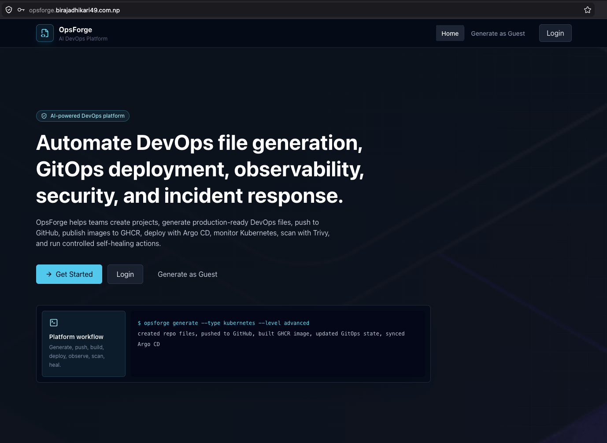
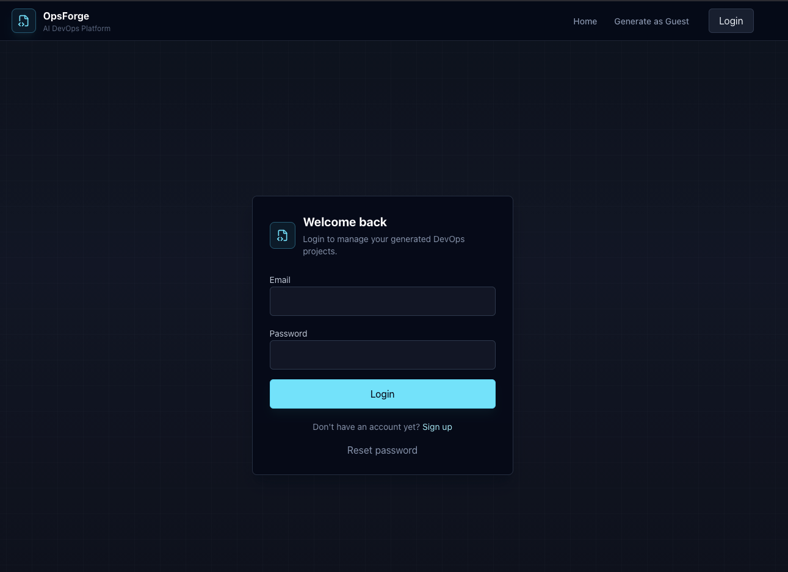
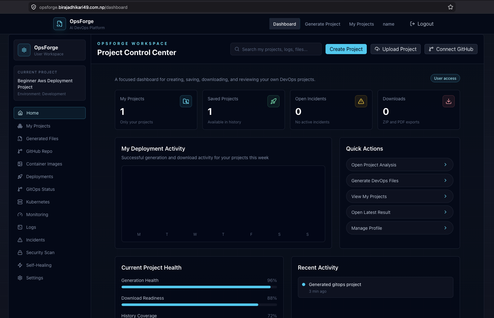
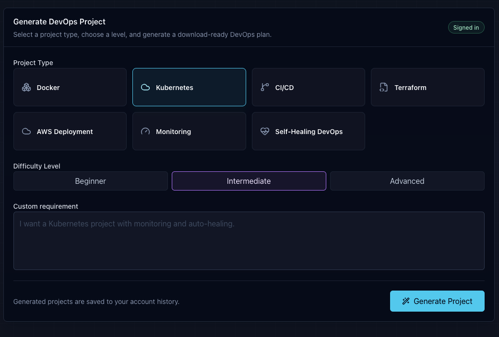
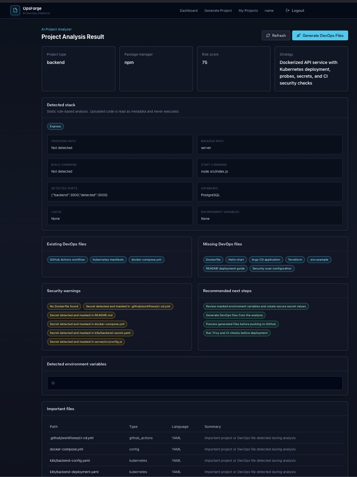
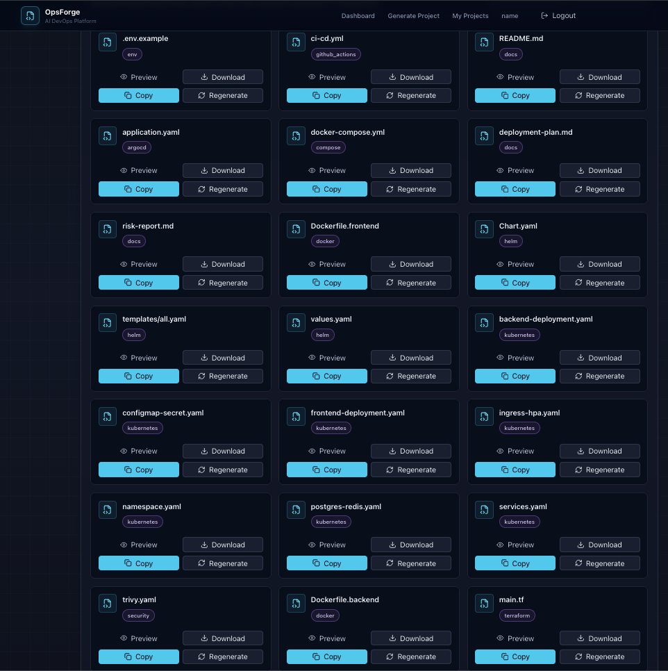
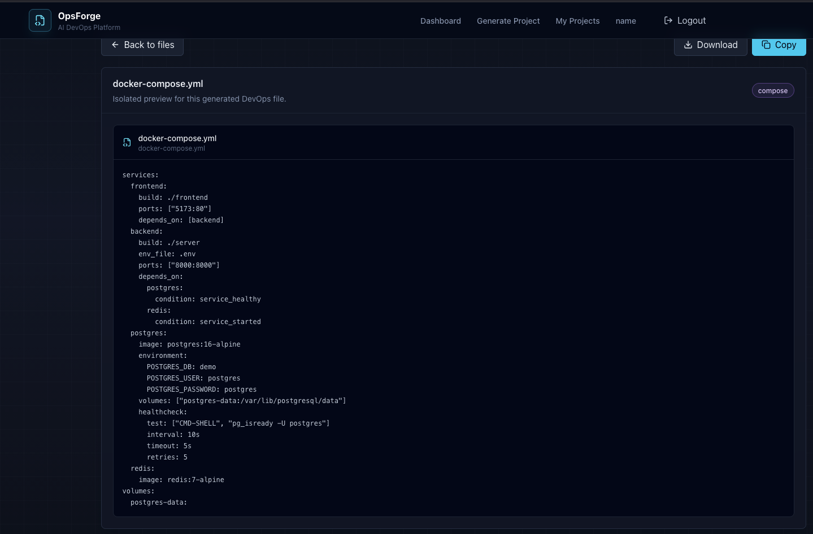

# OpsForge

OpsForge is an AI-powered Internal Developer Platform that helps users create or upload applications, analyze the project stack, generate production-ready DevOps files, push them to GitHub, deploy through Argo CD GitOps to Kubernetes, monitor workloads, scan images with Trivy, detect incidents, and run controlled self-healing actions.

Live deployment:

```text
https://opsforge.birajadhikari49.com.np
```

## What Is Completed

- Authentication with user and admin roles
- Manual DevOps project generation
- Project upload and GitHub repository analysis
- Rule-based and AI-assisted project recommendations
- Secret masking during project analysis
- Docker, Compose, Kubernetes, Helm, Argo CD, GitHub Actions, Terraform, Trivy, and README file generation
- Generated file preview, copy, regenerate, individual download, and ZIP download
- GitHub OAuth connection and generated file push
- OpsForge deployment on EC2 with K3s
- Argo CD GitOps application registration and sync
- Kubernetes pods, services, events, logs, and incident data in the dashboard
- Prometheus, Grafana, and Loki installed for observability
- Trivy image security scanning
- AI/rule-based incident suggestions
- Healing action request and execution flow
- Admin dashboard for user management, project visibility, usage, and audit logs
- GitHub Actions workflow for OpsForge platform CI/CD image builds
- Custom domain and HTTPS using cert-manager and Let's Encrypt

## Screenshots

### Landing Page

OpsForge is deployed with a custom HTTPS domain and presents the main platform value: DevOps generation, GitOps deployment, observability, security, and incident response.



### Login

The platform supports authenticated user and admin access.



### User Dashboard

Normal users access the project workflow from the user dashboard, including project generation and upload flows.



### Manual Project Generation

Users can manually select the DevOps category, difficulty level, and requirements before generating a project.



### AI Project Analyzer

Uploaded projects are analyzed safely as metadata. OpsForge detects stack details, ports, package manager, existing DevOps files, missing files, security warnings, and recommended next steps.



### Generated DevOps Files

OpsForge generates lifecycle files for Docker, CI/CD, Kubernetes, Helm, Argo CD, Terraform, Trivy, environment examples, and deployment documentation.



### File Preview

Each generated file has an isolated preview page with copy and download actions.



## Core Workflow

```text
User creates or uploads a project
        ↓
OpsForge analyzes the stack and requirements
        ↓
OpsForge generates DevOps lifecycle files
        ↓
User previews, copies, downloads, or regenerates files
        ↓
User pushes files to GitHub through GitHub OAuth
        ↓
GitHub Actions builds and publishes container images
        ↓
Argo CD syncs Kubernetes manifests from Git
        ↓
OpsForge shows Kubernetes, logs, security, incidents, and healing actions
```

## CI/CD

OpsForge includes a GitHub Actions workflow for the platform itself:

- Runs backend tests
- Builds the frontend
- Builds backend and frontend Docker images
- Pushes images to GitHub Container Registry
- Tags images with `latest` and the commit SHA

Workflow file:

```text
.github/workflows/opsforge-ci-cd.yml
```

Images:

```text
ghcr.io/biraj49/opsforge-backend:latest
ghcr.io/biraj49/opsforge-frontend:latest
```

The current deployment step is GitOps-oriented: images are pushed to GHCR, then Kubernetes deployments can be restarted or synced through Argo CD.

## GitOps And Kubernetes

OpsForge runs on EC2 using K3s and Nginx Ingress. Argo CD is installed in the cluster and is used to register and sync generated applications.

Completed capabilities:

- Argo CD application creation from OpsForge
- Application sync status tracking
- Kubernetes resource visibility
- Pod logs and events
- Namespace separation for platform and user apps
- Basic self-healing actions such as restart requests and execution

## Observability

The cluster includes:

- Prometheus for metrics
- Grafana for dashboards
- Loki and Promtail for logs

OpsForge also exposes monitoring pages that read real cluster metrics and workload data.

## Security Scanning

Trivy is integrated for image scanning. Scan results are shown in the OpsForge security dashboard with severity, target, recommendation, and status.

## Incident Analysis And Healing

OpsForge detects unhealthy Kubernetes workloads and produces incident suggestions using rule-based logic and AI assistance when configured. Users can create incidents and request restart actions. Admin-controlled execution is supported for risky actions.

## Admin Dashboard

The admin dashboard is intentionally separated from normal user project creation flows.

Admins can:

- View platform overview
- View users
- Disable users
- View user-created projects
- Review system usage
- Review audit logs

Admins cannot use the normal project creation and upload workflow.

## Audit Logs

OpsForge records important actions including:

- User login/logout
- Project creation and deletion
- Project upload and analysis
- File generation
- GitHub connection and file push
- GitOps registration and sync
- Security scan
- Incident analysis
- Healing action request, approval, and execution
- Admin user actions

## Tech Stack

Frontend:

- React
- Vite
- Tailwind CSS
- Lucide icons

Backend:

- FastAPI
- SQLAlchemy
- Alembic
- PostgreSQL
- Redis

DevOps:

- Docker
- GitHub Actions
- GitHub Container Registry
- Kubernetes / K3s
- Argo CD
- Nginx Ingress
- cert-manager
- Let's Encrypt
- Prometheus
- Grafana
- Loki
- Trivy

## Local Development

### Frontend

```bash
cd frontend
npm install
npm run dev
```

Frontend runs at:

```text
http://localhost:5173
```

### Backend

```bash
cd backend
cp .env.example .env
docker compose up --build
```

Backend API runs at:

```text
http://localhost:8000/api
```

For local non-Docker backend development, see:

```text
backend/README.md
```

## Deployment

OpsForge is deployed on EC2 with K3s.

Platform namespace:

```text
opsforge-system
```

Main deployment resources are stored in:

```text
deploy/k8s/opsforge/
```

To restart the deployed platform after pushing new images:

```bash
kubectl rollout restart deployment/opsforge-backend -n opsforge-system
kubectl rollout restart deployment/opsforge-frontend -n opsforge-system
```

Check rollout status:

```bash
kubectl rollout status deployment/opsforge-backend -n opsforge-system
kubectl rollout status deployment/opsforge-frontend -n opsforge-system
```

## Environment Variables

Use `.env.example` files as references. Real secrets should not be committed.

Important backend values include:

```text
DATABASE_URL
REDIS_URL
JWT_SECRET_KEY
ADMIN_EMAIL
ADMIN_PASSWORD
GITHUB_OAUTH_CLIENT_ID
GITHUB_OAUTH_CLIENT_SECRET
OPENROUTER_API_KEY
RESEND_API_KEY
SMTP_FROM_EMAIL
```

## Remaining Work

- Add final screenshots for GitHub Actions, Argo CD, Kubernetes, monitoring, Trivy, incidents, healing, admin pages, and audit logs
- Polish generated app deployment templates for every stack type
- Make GitOps image tag updates fully automatic
- Add deeper Grafana/Loki embeds or links inside OpsForge
- Add cloud cost visibility later
- Record final demo video

## Project Summary

OpsForge demonstrates a practical Internal Developer Platform workflow: project analysis, DevOps file generation, GitHub automation, container image delivery, GitOps deployment, Kubernetes visibility, security scanning, incident analysis, and controlled self-healing from one dashboard.
