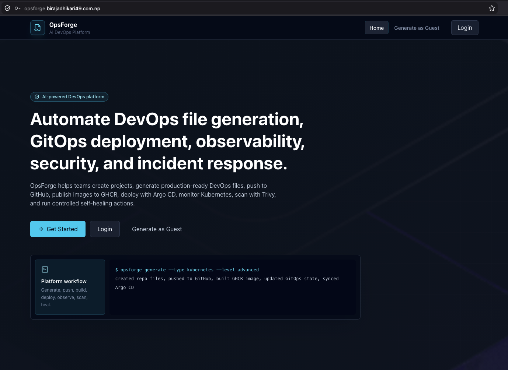
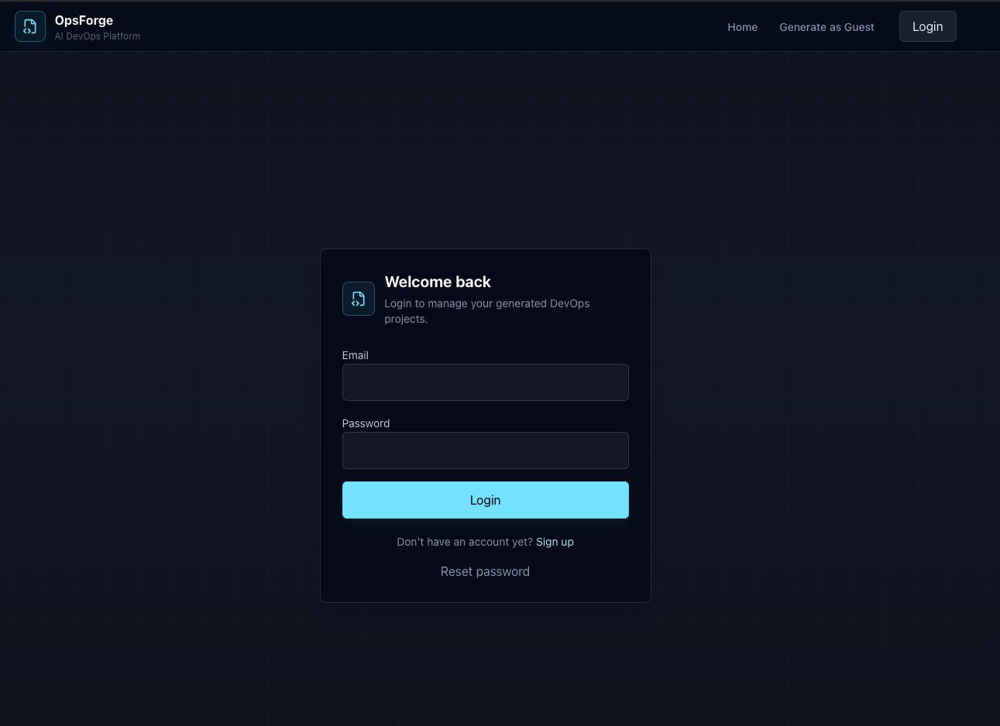
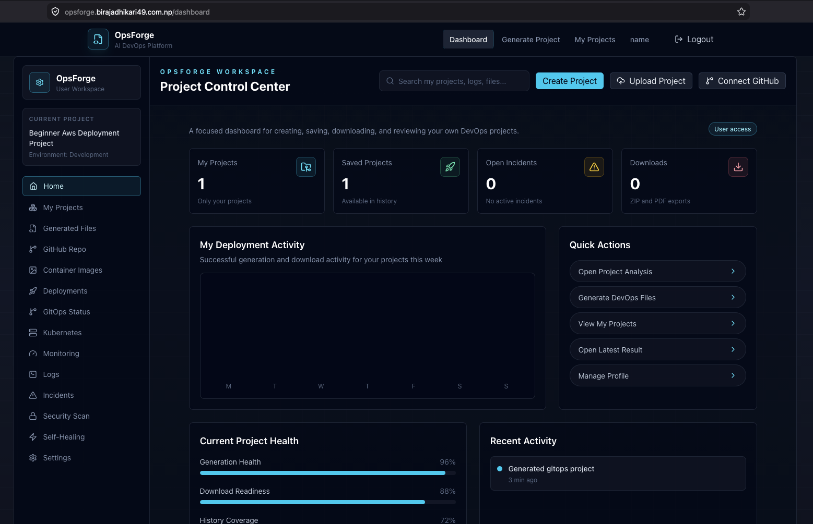
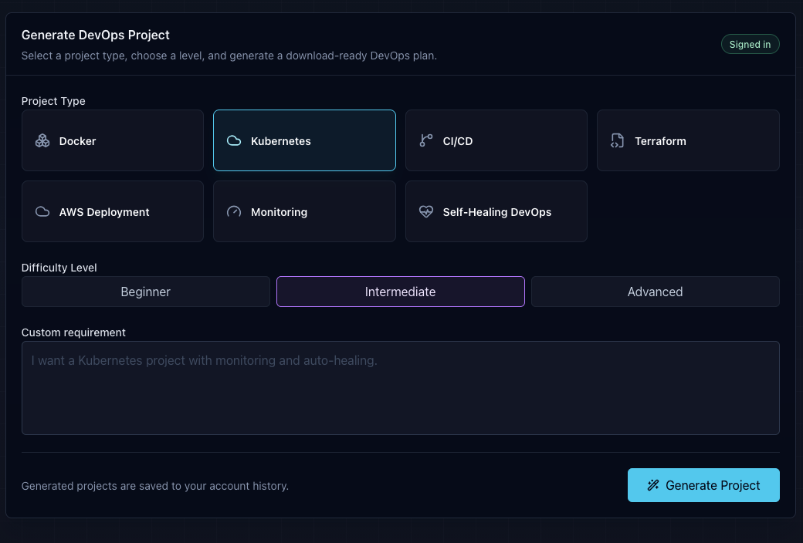
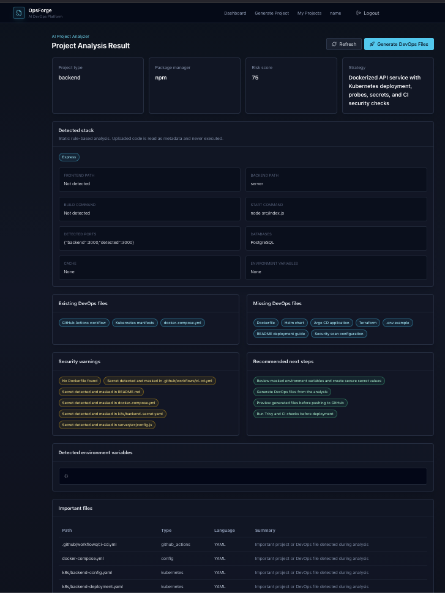
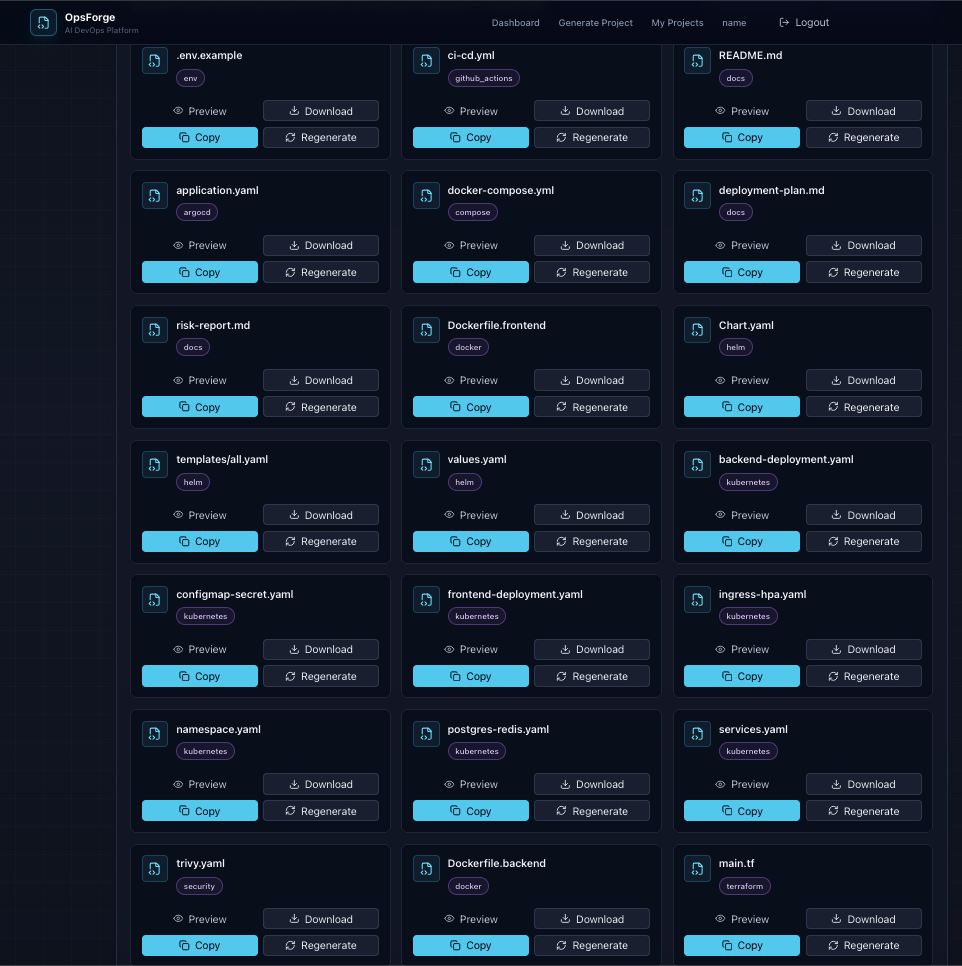
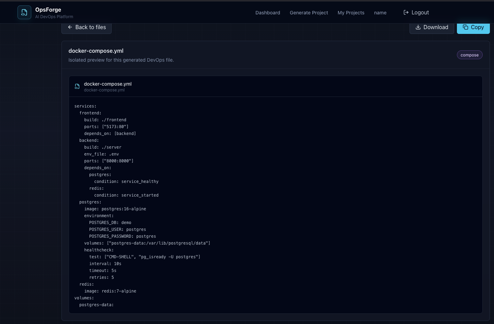
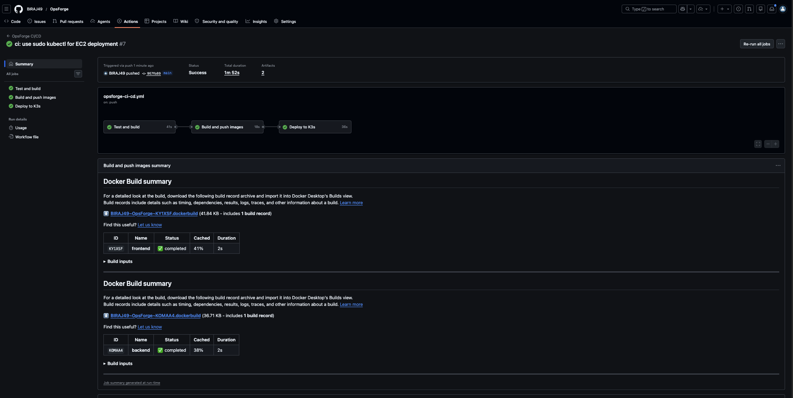

# OpsForge

OpsForge is a DevOps dashboard for creating or uploading projects, checking the stack, generating deployment files, pushing them to GitHub, deploying with Argo CD, and keeping an eye on Kubernetes, logs, scans, and incidents.

Live deployment:

```text
https://opsforge.birajadhikari49.com.np
```

## What Is Completed

- Authentication with user and admin roles
- Manual DevOps project generation
- Project upload and GitHub repository analysis
- Project recommendations from rules, with AI assistance when configured
- Secret masking during project analysis
- Docker, Compose, Kubernetes, Helm, Argo CD, GitHub Actions, Terraform, Trivy, and README file generation
- Generated file preview, copy, regenerate, individual download, and ZIP download
- GitHub OAuth connection and generated file push
- OpsForge deployment on EC2 with K3s
- Argo CD GitOps application registration and sync
- Kubernetes pods, services, events, logs, and incident data in the dashboard
- Prometheus, Grafana, and Loki installed for observability
- Trivy image security scanning
- Incident suggestions from rules, with AI assistance when configured
- Healing action request and execution flow
- Admin dashboard for user management, project visibility, usage, and audit logs
- GitHub Actions workflow for OpsForge image builds and deployment
- Custom domain and HTTPS using cert-manager and Let's Encrypt

## Screenshots

### Landing Page

OpsForge is deployed behind HTTPS and shows the main user flows: file generation, GitOps deployment, monitoring, scanning, and incident handling.



### Login

The app supports separate user and admin accounts.



### User Dashboard

Users can create projects, upload existing code, and open their saved work from the dashboard.



### Manual Project Generation

Users choose a category, difficulty level, and requirements before generating files.



### AI Project Analyzer

Uploaded projects are analyzed as metadata. OpsForge detects stack details, ports, package managers, existing DevOps files, missing files, security warnings, and next steps.



### Generated DevOps Files

OpsForge generates Docker, CI/CD, Kubernetes, Helm, Argo CD, Terraform, Trivy, env example, and deployment docs.



### File Preview

Each generated file has an isolated preview page with copy and download actions.



### GitHub Actions CI/CD

OpsForge includes a GitHub Actions pipeline that tests the application, scans the exact release images, publishes them to GHCR with SBOMs and attestations, and opens a reviewed digest-only GitOps promotion pull request.



## Core Workflow

```text
User creates or uploads a project
        ↓
OpsForge analyzes the stack and requirements
        ↓
OpsForge generates DevOps files
        ↓
User previews, copies, downloads, or regenerates files
        ↓
User pushes files to GitHub through GitHub OAuth
        ↓
GitHub Actions builds and publishes container images
        ↓
Argo CD syncs Kubernetes manifests from Git
        ↓
OpsForge shows Kubernetes, logs, security, incidents, and healing actions
```

## CI/CD

OpsForge has a GitHub Actions workflow for this repo:

- Runs backend tests
- Builds the frontend
- Builds backend and frontend Docker images
- Pushes images to GitHub Container Registry
- Publishes commit-SHA images and promotes immutable digests
- Generates CycloneDX SBOMs and build attestations
- Opens a reviewed GitOps promotion pull request

Workflow file:

```text
.github/workflows/opsforge-ci-cd.yml
```

Images:

```text
ghcr.io/biraj49/opsforge-backend:<commit-sha>
ghcr.io/biraj49/opsforge-frontend:<commit-sha>
```

The application workflow never writes to the cluster. It pushes verified images to GHCR and opens a digest-only pull request in the dedicated GitOps repository. Argo CD reconciles the merged desired state. Terraform validation/planning, explicitly approved infrastructure applies, and external uptime checks run in separate workflows.

## GitOps And Kubernetes

OpsForge runs on EC2 using K3s and Nginx Ingress. Argo CD is installed in the cluster and is used to register and sync generated applications.

Completed capabilities:

- Argo CD application creation from OpsForge
- Application sync status tracking
- Kubernetes resource visibility
- Pod logs and events
- Namespace separation for platform and user apps
- Basic self-healing actions such as restart requests and execution

## Observability

The cluster includes:

- Prometheus for metrics
- Grafana for dashboards
- Loki and Grafana Alloy for logs

OpsForge also has monitoring pages for cluster metrics and workload data.

## Security Scanning

Trivy is used for image scanning. Results show severity, target, recommendation, and status.

## Incident Analysis And Healing

OpsForge detects unhealthy Kubernetes workloads and suggests fixes using rules, with AI assistance when configured. Users can create incidents and request restarts. Admin approval is used for risky actions.

## Admin Dashboard

The admin dashboard is intentionally separated from normal user project creation flows.

Admins can:

- View platform overview
- View users
- Disable users
- View user-created projects
- Review system usage
- Review audit logs

Admins use the admin area instead of the normal project creation and upload flow.

## Audit Logs

OpsForge records important actions:

- User login/logout
- Project creation and deletion
- Project upload and analysis
- File generation
- GitHub connection and file push
- GitOps registration and sync
- Security scan
- Incident analysis
- Healing action request, approval, and execution
- Admin user actions

## Tech Stack

Frontend:

- React
- Vite
- Tailwind CSS
- Lucide icons

Backend:

- FastAPI
- SQLAlchemy
- Alembic
- PostgreSQL
- Redis

DevOps:

- Docker
- GitHub Actions
- GitHub Container Registry
- Kubernetes / K3s
- Argo CD
- Nginx Ingress
- cert-manager
- Let's Encrypt
- Prometheus
- Grafana
- Loki
- Trivy

## Local Development

### Frontend

```bash
cd frontend
npm install
npm run dev
```

Frontend runs at:

```text
http://localhost:5173
```

### Backend

```bash
cd backend
cp .env.example .env
docker compose up --build
```

Backend API runs at:

```text
http://localhost:8000/api
```

For local non-Docker backend development, see:

```text
backend/README.md
```

## Deployment

OpsForge is deployed on EC2 with K3s.

Platform namespace:

```text
opsforge-system
```

Main deployment resources are stored in:

```text
deploy/k8s/opsforge/
```

Emergency restarts create runtime drift and are not a release mechanism. Normal rollback or redeployment is a reviewed Git revert or digest change in the GitOps repository. If an operator performs an emergency restart, record it and verify that Argo CD returns the application to `Synced` and `Healthy`:

```bash
kubectl rollout restart deployment/opsforge-backend -n opsforge-system
kubectl rollout restart deployment/opsforge-frontend -n opsforge-system
```

Check rollout status:

```bash
kubectl rollout status deployment/opsforge-backend -n opsforge-system
kubectl rollout status deployment/opsforge-frontend -n opsforge-system
```

## Environment Variables

Use `.env.example` files as references. Real secrets should not be committed.

Important backend values include:

```text
DATABASE_URL
REDIS_URL
JWT_SECRET_KEY
ADMIN_EMAIL
ADMIN_PASSWORD
GITHUB_OAUTH_CLIENT_ID
GITHUB_OAUTH_CLIENT_SECRET
OPENROUTER_API_KEY
RESEND_API_KEY
SMTP_FROM_EMAIL
```

## Remaining Work

- Add final screenshots for GitHub Actions, Argo CD, Kubernetes, monitoring, Trivy, incidents, healing, admin pages, and audit logs
- Polish generated app deployment templates for every stack type
- Create and protect the dedicated GitOps repository, then enable digest promotion PRs
- Add deeper Grafana/Loki embeds or links inside OpsForge
- Add cloud cost visibility later
- Record final demo video

## Project Summary

OpsForge brings the main project operations into one place: analysis, file generation, GitHub push, image delivery, GitOps deployment, Kubernetes visibility, security scans, incident review, and controlled healing actions.
