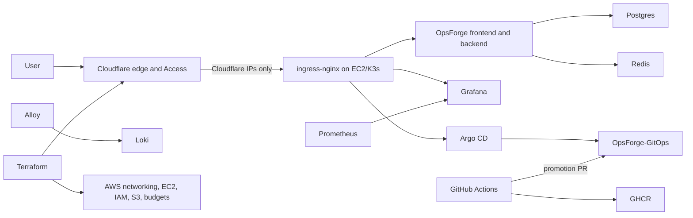

# Production Platform

OpsForge uses a production-style, single-node GitOps platform. It provides repeatable delivery, security controls, monitoring, and recovery without claiming multi-AZ availability.

## Architecture

Public endpoints:

- `https://opsforge.birajadhikari49.com.np`
- `https://grafana.birajadhikari49.com.np` through Cloudflare Access
- `https://argocd.birajadhikari49.com.np` through Cloudflare Access

Prometheus, Loki, Alertmanager, PostgreSQL, Redis, the Kubernetes API, and internal services have no public DNS records.

## Delivery

Application pull requests run backend and frontend lint, tests, coverage, dependency audits, SonarQube, secret/IaC scans, and exact-image Trivy scans. A stable, fail-closed `CI and security gate` aggregates those event-driven checks. Protected-main releases repeat the validation, build each image once in an unprivileged job, scan the exact archives, and generate CycloneDX SBOMs. A separate least-privilege job verifies the bundle, publishes it without rebuilding, and attaches GitHub OIDC-backed provenance and SBOM attestations. A repository-scoped GitHub App can then open or update a staging-only digest promotion PR in `OpsForge-GitOps`. Production promotion is a later reviewed Git change; Argo CD deploys only merged Git state.

The production API image deliberately contains no Trivy binary. Its optional
synchronous scanner is disabled in production; the release gate is the sole
application-image scan authority until on-demand scanning is moved to an
isolated, least-privilege worker. GitOps-repository policy validation remains a
separate trust boundary because it evaluates the desired state that Argo CD
will actually reconcile.

The Actions workflows use a full-SHA-pinned Trivy action and an explicitly pinned Trivy release. They do not upload SARIF or enable GitHub CodeQL/default scanning. Scanner upgrades are reviewed changes to the protected workflows, not scheduled bot pull requests.

The application workflow runs credential-free Trivy IaC checks over Terraform and deployment configuration. Terraform format, initialization, validation, production planning, and applying run separately through an operator-controlled infrastructure process with protected state, least-privilege credentials, and exact-plan review.

## Objectives And Limits

- PostgreSQL backup RPO: 24 hours or better.
- Documented rebuild RTO: 2 hours.
- This environment has one EC2 node, local-path volumes, and no automatic AZ failover.
- A node or AZ failure causes downtime until recovery.
- The future HA path is EKS across multiple AZs, RDS Multi-AZ, ElastiCache, and object-backed observability.

## Required Repository Configuration

`BIRAJ49/OpsForge-GitOps` is the canonical multi-environment desired-state
repository. The old `scripts/bootstrap-gitops-repository.sh` helper creates only
a legacy production scaffold and must not be used for a new installation.
Protect GitOps `main` with `GitOps policy gate`, at least one CODEOWNER approval,
stale-review dismissal, conversation resolution, and no administrator bypass.
Production promotions are always reviewed pull requests.

Create a repository-scoped GitHub App installed only on `OpsForge-GitOps` with Contents and Pull requests read/write. Add `GITOPS_APP_CLIENT_ID` and `GITOPS_APP_PRIVATE_KEY` to the application repository secrets. Keep `ENABLE_GITOPS_STAGING_PROMOTION=false` until the staging overlay, GitOps policy checks, and Argo CD staging application are ready. The application workflow never promotes production.

Protect this repository's `main` branch with the stable `CI and security gate` check from `.github/workflows/pr-check.yml`; that job fails closed when any prerequisite quality, build, or security control fails. Require pull requests, at least one CODEOWNER approval, stale-review dismissal, last-push approval, and resolved review conversations. Keep the default `GITHUB_TOKEN` permission read-only and allow only approved, full-SHA-pinned actions. The exact settings are in `github-rulesets.md`.

Manual runs of `Build and stage release` are rejected unless launched from `main`. They repeat CI and security checks, publish full-Git-SHA images, and may update staging when the staging promotion feature flag is enabled. They cannot promote production.

## External Uptime

GitHub Actions does not run a scheduled uptime workflow. Configure an independent synthetic-monitoring service and external alert path before relying on this platform for a production SLO.
