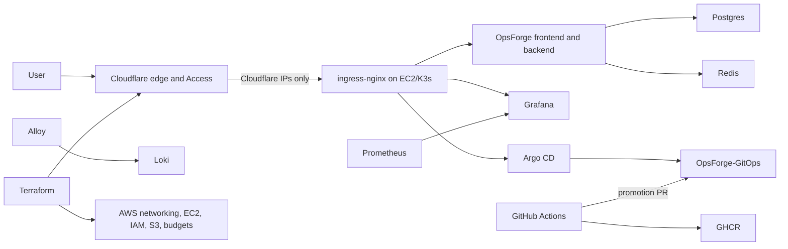

# Production Platform

OpsForge uses a production-style, single-node GitOps platform. It provides repeatable delivery, security controls, monitoring, and recovery without claiming multi-AZ availability.

## Architecture



Public endpoints:

- `https://opsforge.birajadhikari49.com.np`
- `https://grafana.birajadhikari49.com.np` through Cloudflare Access
- `https://argocd.birajadhikari49.com.np` through Cloudflare Access

Prometheus, Loki, Alertmanager, PostgreSQL, Redis, the Kubernetes API, and internal services have no public DNS records.

## Delivery

Application pull requests run backend, frontend, workflow, Terraform, Kustomize, and Compose quality checks before building each image exactly once in an unprivileged job. One fail-closed `Security gate` then audits Python and Node production dependencies, enforces high/critical CodeQL findings, scans secrets and IaC, scans the exact image archives, and generates validated CycloneDX SBOMs. Release receives those archives by immutable artifact ID, verifies GitHub artifact digests, independent SHA-256 checksums, and commit-bound approval evidence, then publishes without rebuilding and attaches GitHub OIDC-backed attestations. A repository-scoped GitHub App can then open a digest promotion PR in `OpsForge-GitOps`. Production promotion requires review; Argo CD deploys only merged Git state.

Terraform pull requests run credential-free format and validation checks. Trusted `main`, scheduled, and manually dispatched runs use a read-only OIDC role for production plans. Automated production apply remains disabled until reviewers can approve a redacted summary and checksum of the exact saved plan, the protected apply job can verify that same plan, and the apply role can no longer modify its own IAM authority. State is encrypted and locked in private, versioned S3.

The OIDC provider and roles have a one-time bootstrap dependency: create them with authenticated local Terraform first. After their ARN outputs are saved as repository variables, all later plans and applies use short-lived OIDC credentials.

## Objectives And Limits

- PostgreSQL backup RPO: 24 hours or better.
- Documented rebuild RTO: 2 hours.
- This environment has one EC2 node, local-path volumes, and no automatic AZ failover.
- A node or AZ failure causes downtime until recovery.
- The future HA path is EKS across multiple AZs, RDS Multi-AZ, ElastiCache, and object-backed observability.

## Required Repository Configuration

Create `BIRAJ49/OpsForge-GitOps` and seed the one-time, production-only migration scaffold with two already published image digests:

```bash
scripts/bootstrap-gitops-repository.sh ../OpsForge-GitOps \
  ghcr.io/biraj49/opsforge-backend@sha256:<64-hex-digest> \
  ghcr.io/biraj49/opsforge-frontend@sha256:<64-hex-digest>
```

The helper creates `CODEOWNERS`, a validation workflow, and digest-pinned state. It is not the final multi-environment repository design: migrate to the layout in `gitops-production-roadmap.md` and stop maintaining the source-repository copy. Protect GitOps `main` with `Render and scan manifests` required, at least one CODEOWNER approval, stale-review dismissal, and no administrator bypass. Do not automatically merge production promotions.

Create a repository-scoped GitHub App installed only on `OpsForge-GitOps` with Contents and Pull requests read/write. Add `GITOPS_APP_CLIENT_ID` and `GITOPS_APP_PRIVATE_KEY` to the application repository secrets. Keep `ENABLE_GITOPS_PROMOTION` unset until every blocker and exit criterion in `gitops-production-roadmap.md` is complete, including staged promotion and restricted Argo/RBAC boundaries.

Protect this repository's `main` branch with the stable `Security gate` check from `.github/workflows/opsforge-ci-cd.yml`; that job fails closed when any prerequisite quality, build, or security control fails. Require pull requests, at least one approval, stale-review dismissal, and resolved review conversations. Create the `production` GitHub environment with required reviewer approval, a `main`-only deployment branch policy, and administrator bypass disabled. Keep `ENABLE_TERRAFORM_APPLY` unset until those controls, exact-plan approval, and the IAM separation required by `gitops-production-roadmap.md` are all implemented and tested. Add Terraform repository variables listed in `infra/terraform/terraform.tfvars.example` and the two OIDC role ARN variables. Use a read-only Cloudflare token named `CLOUDFLARE_API_TOKEN` at repository scope for trusted-main plans, and override it with a write-capable secret of the same name only in the protected `production` environment. Keep the default `GITHUB_TOKEN` permission read-only and allow only approved, full-SHA-pinned actions.

## External Uptime

The separate `Production synthetic check` workflow checks `https://opsforge.birajadhikari49.com.np/api/health` every fifteen minutes from outside the cluster. Its result cannot turn an otherwise successful build or Terraform apply red. Enable failed-workflow notifications and configure Cloudflare to permit this health endpoint. Replace the workflow with an independent synthetic-monitoring service and external alert path before relying on this platform for a production SLO.
