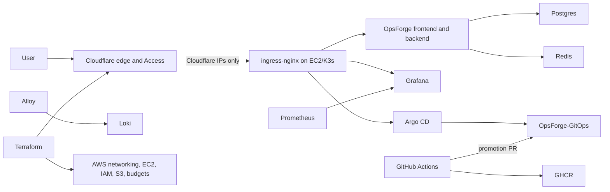

# Production Platform

OpsForge uses a production-style, single-node GitOps platform. It provides repeatable delivery, security controls, monitoring, and recovery without claiming multi-AZ availability.

## Architecture



Public endpoints:

- `https://opsforge.birajadhikari49.com.np`
- `https://grafana.birajadhikari49.com.np` through Cloudflare Access
- `https://argocd.birajadhikari49.com.np` through Cloudflare Access

Prometheus, Loki, Alertmanager, PostgreSQL, Redis, the Kubernetes API, and internal services have no public DNS records.

## Delivery

Application pull requests run backend, frontend, workflow, Terraform, Kustomize, and Compose quality checks before building each image exactly once in an unprivileged job. One fail-closed `Security gate` then audits Python and Node production dependencies, enforces high/critical CodeQL findings, scans secrets and IaC, scans the exact image archives, and generates validated CycloneDX SBOMs. The same gate reproducibly builds the pinned Trivy scanner and age encryptor from asserted source trees and exact dependency patches, verifies their build metadata and raw hashes, and self-scans both before use. Release receives the image archives by immutable artifact ID, verifies GitHub artifact digests, independent SHA-256 checksums, and commit-bound approval evidence, then publishes without rebuilding and attaches GitHub OIDC-backed attestations. A repository-scoped GitHub App can then open a digest promotion PR in `OpsForge-GitOps`. Production promotion requires review; Argo CD deploys only merged Git state.

The production API image deliberately contains no Trivy binary. Its optional
synchronous scanner is disabled in production; the release gate is the sole
application-image scan authority until on-demand scanning is moved to an
isolated, least-privilege worker. GitOps-repository policy validation remains a
separate trust boundary because it evaluates the desired state that Argo CD
will actually reconcile.

Trivy `v0.73.0-opsforge.1` and age `v1.3.1-opsforge.1` are temporary OpsForge-maintained derivatives, not upstream releases and not vulnerability waivers. The platform owner must review and replace both with the first clean official releases no later than 2026-09-30. Their upstream commits, source trees, deterministic patch commits, module graphs, binary hashes, and self-scan reports are retained in release evidence.

Terraform pull requests run credential-free format and validation checks inside the same workflow. Trusted `main`, scheduled, and manually dispatched production plans run only after the central `Security gate` succeeds and use the read-only OIDC plan role. Push, schedule, `terraform-plan`, and no-change apply requests publish only a redacted address/action summary and SHA-256 hashes; they do not retain the binary plan or full JSON. For a valid `terraform-apply`, the gate uploads only its scanned age binary and SHA manifest as an immutable one-day artifact. Plan and apply jobs resolve that current-run artifact by ID, verify its service digest, exact inventory, raw hash, Go build metadata, and version, and reject any substitution. A request with changes encrypts the exact plan and stores only `tfplan.age`, the redacted summary, and a commit/run-attempt-bound manifest as another immutable one-day artifact. The plaintext plan is deleted on every job path. The protected `production` job downloads and verifies that evidence, obtains the private age identity from the environment secret, decrypts into runner-temporary storage, recomputes the plaintext hash, and applies it without replanning. State is encrypted and locked in private, versioned S3. The public ciphertext may be copied indefinitely and age provides no forward secrecy against later compromise of this static identity, so rotate and protect the key accordingly and never put secrets, personal data, or confidential values in Terraform resource keys or addresses exposed by the redacted summary.

The OIDC provider and roles have a one-time bootstrap dependency: create them with authenticated local Terraform first. After their ARN outputs are saved as repository variables, all later plans and applies use short-lived OIDC credentials.

## Objectives And Limits

- PostgreSQL backup RPO: 24 hours or better.
- Documented rebuild RTO: 2 hours.
- This environment has one EC2 node, local-path volumes, and no automatic AZ failover.
- A node or AZ failure causes downtime until recovery.
- The future HA path is EKS across multiple AZs, RDS Multi-AZ, ElastiCache, and object-backed observability.

## Required Repository Configuration

Create `BIRAJ49/OpsForge-GitOps` and seed the one-time, production-only migration scaffold with two already published image digests:

```bash
scripts/bootstrap-gitops-repository.sh ../OpsForge-GitOps \
  ghcr.io/biraj49/opsforge-backend@sha256:<64-hex-digest> \
  ghcr.io/biraj49/opsforge-frontend@sha256:<64-hex-digest>
```

The helper creates `CODEOWNERS`, a validation workflow, and digest-pinned state. It is not the final multi-environment repository design: migrate to the layout in `gitops-production-roadmap.md` and stop maintaining the source-repository copy. Protect GitOps `main` with `Render and scan manifests` required, at least one CODEOWNER approval, stale-review dismissal, and no administrator bypass. Do not automatically merge production promotions.

Create a repository-scoped GitHub App installed only on `OpsForge-GitOps` with Contents and Pull requests read/write. Add `GITOPS_APP_CLIENT_ID` and `GITOPS_APP_PRIVATE_KEY` to the application repository secrets. Keep `ENABLE_GITOPS_PROMOTION` unset until every blocker and exit criterion in `gitops-production-roadmap.md` is complete, including staged promotion and restricted Argo/RBAC boundaries.

Protect this repository's `main` branch with the stable `Security gate` check from `.github/workflows/opsforge-ci-cd.yml`; that job fails closed when any prerequisite quality, build, or security control fails. Require pull requests, at least one approval, stale-review dismissal, and resolved review conversations. Create the `production` GitHub environment with required reviewer approval, a `main`-only deployment branch policy, and administrator bypass disabled. Reviewers must inspect the `Terraform production plan` job's redacted address/action table, plaintext-plan hash, encrypted-plan hash, summary hash, recipient hash, plan artifact ID/digest, and age artifact ID/digest/version/raw hash before approving the environment. An expired approval, a failed or partial apply, or an attempted rerun with a different run-attempt number must fail closed and be replaced by a fresh `terraform-apply` dispatch and approval.

Keep `ENABLE_TERRAFORM_APPLY` unset until those controls, exact-plan approval, and the IAM separation required by `gitops-production-roadmap.md` are all implemented and tested. The current apply role can manage `opsforge-*` IAM roles and policies, including authority related to itself, so the feature flag is a mandatory safety boundary until a bootstrap role and permissions boundary prevent self-escalation. Add the Terraform repository variables listed in `infra/terraform/terraform.tfvars.example` and the two OIDC role ARN variables. Use a read-only Cloudflare token named `CLOUDFLARE_API_TOKEN` at repository scope for trusted-main plans, and override it with a write-capable secret of the same name only in the protected `production` environment. Keep the default `GITHUB_TOKEN` permission read-only and allow only approved, full-SHA-pinned actions. Keep merge commits as the repository's only merge strategy: a squash-merged Dependabot commit is authored by Dependabot and receives a read-only token on `main`, which cannot upload SARIF or publish the approved images.

Generate the Terraform plan-encryption key offline with age 1.3.1 or newer, outside the repository checkout, and store the two halves in different GitHub trust scopes. The exact filename is also ignored defensively, but the private identity must never enter the working tree:

```bash
install -d -m 0700 ../opsforge-key-material
age-keygen -o ../opsforge-key-material/terraform-plan-identity.txt
age-keygen -y ../opsforge-key-material/terraform-plan-identity.txt
```

Set the printed `age1...` public recipient as the repository variable `TERRAFORM_PLAN_AGE_RECIPIENT`. Set the complete contents of `../opsforge-key-material/terraform-plan-identity.txt` as the `TERRAFORM_PLAN_AGE_IDENTITY` secret only in the protected `production` environment, then move or destroy the local identity according to the organization's key-custody policy. Never store the private identity as a repository secret, variable, artifact, or committed file. The central gate builds and self-scans the temporary OpsForge age derivative, then passes the exact binary to plan and apply through the immutable artifact contract described above; neither consumer downloads an upstream executable. Rotating the recipient invalidates pending apply artifacts, so create a fresh plan after rotation.

Manual runs of `OpsForge production CI/CD` expose three operations: `ci`, `terraform-plan`, and `terraform-apply`. Production plan/apply operations must target `main`; apply additionally requires the exact confirmation `production` and `ENABLE_TERRAFORM_APPLY=true`. A no-change apply request ends after the redacted plan summary, uploads no plan artifact, and never obtains production write credentials.

## External Uptime

The separate `Production synthetic check` workflow checks `https://opsforge.birajadhikari49.com.np/api/health` every fifteen minutes from outside the cluster. Its result cannot turn an otherwise successful build or Terraform apply red. Enable failed-workflow notifications and configure Cloudflare to permit this health endpoint. Replace the workflow with an independent synthetic-monitoring service and external alert path before relying on this platform for a production SLO.
