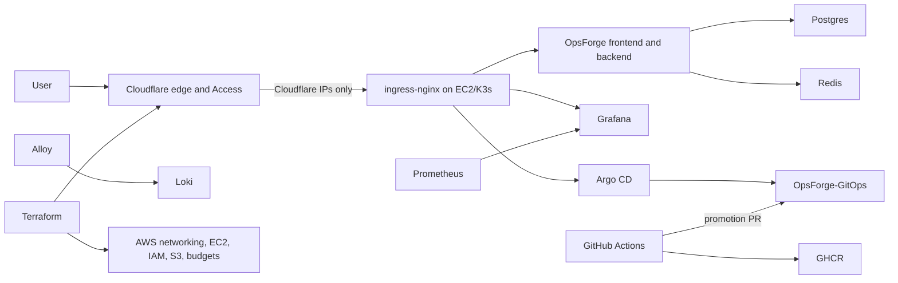

# Production Platform

OpsForge uses a production-style, single-node GitOps platform. It provides repeatable delivery, security controls, monitoring, and recovery without claiming multi-AZ availability.

## Architecture



Public endpoints:

- `https://opsforge.birajadhikari49.com.np`
- `https://grafana.birajadhikari49.com.np` through Cloudflare Access
- `https://argocd.birajadhikari49.com.np` through Cloudflare Access

Prometheus, Loki, Alertmanager, PostgreSQL, Redis, the Kubernetes API, and internal services have no public DNS records.

## Delivery

The deployment-only workflow runs for a push to `main` or a manual dispatch from
`main`. It builds the backend and frontend images for Linux AMD64, publishes
commit-SHA tags to GHCR, captures their immutable registry digests, and updates
the production Kustomize state in `OpsForge-GitOps`. It renders that state and
opens a deployment pull request using a repository-scoped GitHub App. Argo CD
reconciles GitOps `main` only after the pull request is reviewed and merged.

The workflow has no cluster credentials and performs no direct Kubernetes
mutation. It also has no pull-request CI, schedule, dependency bot, security
scanner, SBOM or attestation generation, synthetic monitoring, or Terraform
jobs. Terraform infrastructure work is handled separately from application
delivery.

## Objectives And Limits

- PostgreSQL backup RPO: 24 hours or better.
- Documented rebuild RTO: 2 hours.
- This environment has one EC2 node, local-path volumes, and no automatic AZ failover.
- A node or AZ failure causes downtime until recovery.
- The future HA path is EKS across multiple AZs, RDS Multi-AZ, ElastiCache, and object-backed observability.

## Required Repository Configuration

Create `BIRAJ49/OpsForge-GitOps` and seed the one-time, production-only migration scaffold with two already published image digests:

```bash
scripts/bootstrap-gitops-repository.sh ../OpsForge-GitOps \
  ghcr.io/biraj49/opsforge-backend@sha256:<64-hex-digest> \
  ghcr.io/biraj49/opsforge-frontend@sha256:<64-hex-digest>
```

The helper creates `CODEOWNERS`, a render-and-digest validation workflow, and digest-pinned state. It is not the final multi-environment repository design: migrate to the layout in `gitops-production-roadmap.md` and stop maintaining the source-repository copy. Protect GitOps `main` with `Render GitOps manifests` required, at least one CODEOWNER approval, stale-review dismissal, and no administrator bypass. Do not automatically merge production promotions.

Create a repository-scoped GitHub App installed only on `OpsForge-GitOps` with Contents and Pull requests read/write. Add `GITOPS_APP_CLIENT_ID` and `GITOPS_APP_PRIVATE_KEY` to the application repository secrets. Optionally set `GITOPS_OWNER` and `GITOPS_REPOSITORY`; they default to the current owner and `OpsForge-GitOps`. Keep the GHCR packages public unless the cluster has an image pull secret.

Protect this repository's `main` branch with pull-request review rules appropriate
for the project, but remove stale required checks such as `Security gate` after
removing those jobs. The delivery workflow's default token is read-only; only
the image publishing job receives `packages: write`, and the short-lived GitHub
App token is scoped to the GitOps repository.

Manual runs of `OpsForge GitOps delivery` must target `main`. They follow the
same image publication and deployment-PR path as a `main` push.

## External Uptime

GitHub Actions does not run a scheduled uptime bot. Configure an independent
synthetic-monitoring service and external alert path before relying on this
platform for a production SLO.
