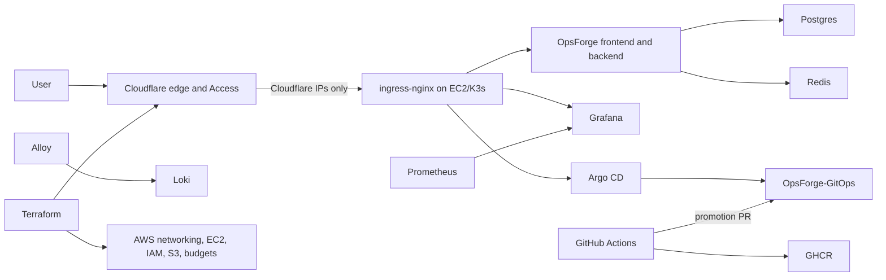

# Production Platform

OpsForge uses a production-style, single-node GitOps platform. It provides repeatable delivery, security controls, monitoring, and recovery without claiming multi-AZ availability.

## Architecture

Public endpoints:

- `https://opsforge.birajadhikari49.com.np`
- `https://grafana.birajadhikari49.com.np` through Cloudflare Access
- `https://argocd.birajadhikari49.com.np` through Cloudflare Access

Prometheus, Loki, Alertmanager, PostgreSQL, Redis, the Kubernetes API, and internal services have no public DNS records.

## Delivery

Application pull requests run tests, CodeQL, manifest/IaC scanning, and local container builds with vulnerability scanning. A main build publishes immutable GHCR images, CycloneDX SBOMs, and GitHub OIDC-backed attestations. A repository-scoped GitHub App opens a digest promotion PR in `OpsForge-GitOps`; required checks and auto-merge form the promotion gate. Argo CD deploys only merged Git state.

Terraform pull requests use a read-only OIDC role. Production applies are started manually, use a separate OIDC role, and run through the protected GitHub `production` environment. State is encrypted and locked in private, versioned S3.

The OIDC provider and roles have a one-time bootstrap dependency: create them with authenticated local Terraform first. After their ARN outputs are saved as repository variables, all later plans and applies use short-lived OIDC credentials.

## Objectives And Limits

- PostgreSQL backup RPO: 24 hours or better.
- Documented rebuild RTO: 2 hours.
- This environment has one EC2 node, local-path volumes, and no automatic AZ failover.
- A node or AZ failure causes downtime until recovery.
- The future HA path is EKS across multiple AZs, RDS Multi-AZ, ElastiCache, and object-backed observability.

## Required Repository Configuration

Create `BIRAJ49/OpsForge-GitOps` and run `scripts/bootstrap-gitops-repository.sh`. Protect its `main` branch with `Render and scan manifests` required and enable auto-merge.

Create a repository-scoped GitHub App installed only on `OpsForge-GitOps` with Contents and Pull requests read/write. Add `GITOPS_APP_CLIENT_ID` and `GITOPS_APP_PRIVATE_KEY` to the application repository secrets, then set the repository variable `ENABLE_GITOPS_PROMOTION=true`.

Create the `production` GitHub environment with required reviewer approval. Add Terraform repository variables listed in `infra/terraform/terraform.tfvars.example`, the two OIDC role ARN variables, and `CLOUDFLARE_API_TOKEN` as an environment secret.

## External Uptime

The `External production uptime` GitHub Actions workflow checks `https://opsforge.birajadhikari49.com.np/api/health` every ten minutes from outside the cluster. Enable GitHub failed-workflow email notifications. This detects total EC2 and cluster outages that in-cluster Prometheus cannot report; a dedicated synthetic-monitoring vendor can replace it later if tighter intervals are required.
