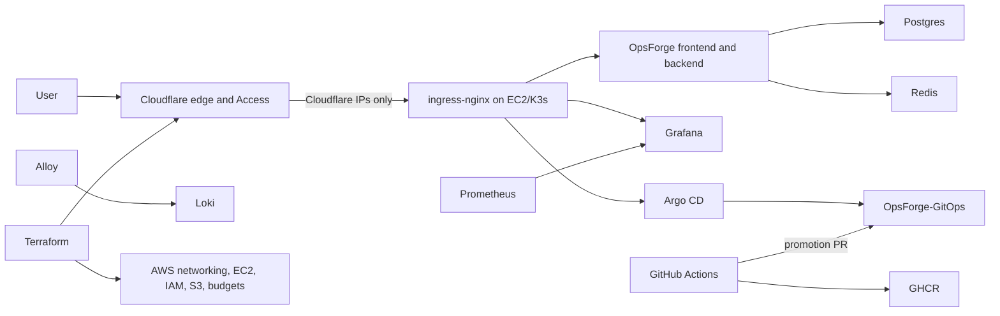

# Production Platform

OpsForge uses a production-style, single-node GitOps platform. It provides repeatable delivery, security controls, monitoring, and recovery without claiming multi-AZ availability.

## Architecture



Public endpoints:

- `https://opsforge.birajadhikari49.com.np`
- `https://grafana.birajadhikari49.com.np` through Cloudflare Access
- `https://argocd.birajadhikari49.com.np` through Cloudflare Access

Prometheus, Loki, Alertmanager, PostgreSQL, Redis, the Kubernetes API, and internal services have no public DNS records.

## Delivery

Application pull requests run backend, frontend, workflow, Terraform, Kustomize, and Compose quality checks before building each image exactly once in an unprivileged job. One fail-closed `Security gate` then audits Python and Node production dependencies, enforces high/critical CodeQL findings, scans secrets and IaC, scans the exact image archives, and generates validated CycloneDX SBOMs. The same gate reproducibly builds the pinned Trivy scanner from an asserted source tree and exact dependency patch, verifies its build metadata and raw hash, and self-scans it before use. Release receives the image archives by immutable artifact ID, verifies GitHub artifact digests, independent SHA-256 checksums, and commit-bound approval evidence, then publishes without rebuilding and attaches GitHub OIDC-backed attestations. A repository-scoped GitHub App can then open a digest promotion PR in `OpsForge-GitOps`. Production promotion requires review; Argo CD deploys only merged Git state.

The production API image deliberately contains no Trivy binary. Its optional
synchronous scanner is disabled in production; the release gate is the sole
application-image scan authority until on-demand scanning is moved to an
isolated, least-privilege worker. GitOps-repository policy validation remains a
separate trust boundary because it evaluates the desired state that Argo CD
will actually reconcile.

Trivy `v0.73.0-opsforge.1` is a temporary OpsForge-maintained derivative, not an upstream release or vulnerability waiver. The platform owner must review and replace it with the first clean official release no later than 2026-09-30. Its upstream commit, source tree, deterministic patch commit, module graph, binary hash, and self-scan report are retained in release evidence.

Terraform pull requests retain credential-free format, backend-disabled initialization, and validation checks inside the application workflow. Production Terraform planning and applying runs separately through an operator-controlled infrastructure process with protected state, least-privilege credentials, and exact-plan review.

## Objectives And Limits

- PostgreSQL backup RPO: 24 hours or better.
- Documented rebuild RTO: 2 hours.
- This environment has one EC2 node, local-path volumes, and no automatic AZ failover.
- A node or AZ failure causes downtime until recovery.
- The future HA path is EKS across multiple AZs, RDS Multi-AZ, ElastiCache, and object-backed observability.

## Required Repository Configuration

Create `BIRAJ49/OpsForge-GitOps` and seed the one-time, production-only migration scaffold with two already published image digests:

```bash
scripts/bootstrap-gitops-repository.sh ../OpsForge-GitOps \
  ghcr.io/biraj49/opsforge-backend@sha256:<64-hex-digest> \
  ghcr.io/biraj49/opsforge-frontend@sha256:<64-hex-digest>
```

The helper creates `CODEOWNERS`, a validation workflow, and digest-pinned state. It is not the final multi-environment repository design: migrate to the layout in `gitops-production-roadmap.md` and stop maintaining the source-repository copy. Protect GitOps `main` with `Render and scan manifests` required, at least one CODEOWNER approval, stale-review dismissal, and no administrator bypass. Do not automatically merge production promotions.

Create a repository-scoped GitHub App installed only on `OpsForge-GitOps` with Contents and Pull requests read/write. Add `GITOPS_APP_CLIENT_ID` and `GITOPS_APP_PRIVATE_KEY` to the application repository secrets. Keep `ENABLE_GITOPS_PROMOTION` unset until every blocker and exit criterion in `gitops-production-roadmap.md` is complete, including staged promotion and restricted Argo/RBAC boundaries.

Protect this repository's `main` branch with the stable `Security gate` check from `.github/workflows/opsforge-ci-cd.yml`; that job fails closed when any prerequisite quality, build, or security control fails. Require pull requests, at least one approval, stale-review dismissal, and resolved review conversations. Keep the default `GITHUB_TOKEN` permission read-only and allow only approved, full-SHA-pinned actions.

Manual runs of `OpsForge production CI/CD` run CI, security scans, and evidence generation only. Image release and GitOps promotion remain restricted to pushes on `main`.

## External Uptime

GitHub Actions does not run a scheduled uptime workflow. Configure an independent synthetic-monitoring service and external alert path before relying on this platform for a production SLO.
